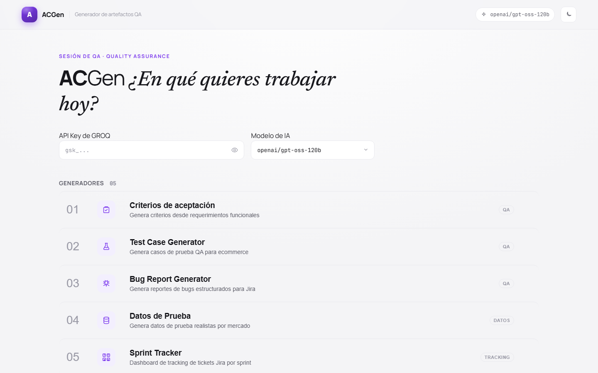

# ACGen: Suite de herramientas de QA automatizadas con IA



**🔗 Demo en vivo: [acgen.vercel.app](https://acgen.vercel.app)**


ACGen es una aplicacion web (SPA) que integra once herramientas para agilizar el trabajo diario de equipos QA: ocho generadores impulsados por IA (multi-proveedor: Groq, OpenRouter o cualquier endpoint compatible con OpenAI), dos herramientas de seguimiento 100% offline (Sprint Tracker y Regression Tracker), y un validador de criterios contra diseño con capacidad de vision. Deploy 100% estatico, sin backend propio.

## Caracteristicas

- **Criterios de Aceptacion**: Genera criterios Dado/Cuando/Entonces desde requisitos o descripcion de tickets. Validacion automatica de formato. Historial persistente de las ultimas 10 generaciones.
- **Test Case Generator**: Genera casos de prueba QA estructurados (JSON) con prioridad, tipo, pasos y resultado esperado. Exporta como tabla estructurada o PDF.
- **Bug Report Generator**: Genera bug reports en formato estructurado con paneles, seleccion de plataforma (web/App Android/App iOS), campos dinamicos y campo de contexto adicional. Historial persistente de las ultimas 10 generaciones.
- **Datos de Prueba**: Genera datos realistas (direcciones, facturacion, registros, tarjetas, cupones) adaptados a 217 mercados. Exporta como TSV o CSV (con proteccion contra inyeccion de formulas en Excel).
- **Historia de Usuario**: Genera historias en formato Como/Quiero/Para con evaluacion de criterios INVEST.
- **Refinador de Requisitos**: Detecta ambiguedades, contradicciones, informacion faltante y dependencias no declaradas en un requisito.
- **Casos Limite**: Genera edge cases agrupados por categoria (valores frontera, estados vacios, concurrencia, i18n, permisos, red).
- **Conversor de Formatos**: Convierte texto entre Gherkin, Markdown, Jira wiki, Azure DevOps y texto plano.
- **Sprint Tracker**: Hoja de calculo offline por sprint con pestanas y columnas configurables (5 pestanas y sus columnas por defecto: Resueltos, Creados, ReOpen, Prioridad Alta, JSD): filas reordenables por drag-and-drop, busqueda con debounce, columnas redimensionables, enlaces a tickets (Ctrl+click), pegado desde SnapLink y archivado historico. Pestanas y columnas se renombran, anaden y ocultan desde el boton "Pestanas y columnas"; ocultar no borra el dato, solo deja de mostrarlo.
- **Regression Tracker**: Lista de regresiones versionadas (Version + URL + Fecha) por plataforma (APPS, WEB por defecto, ampliable), reordenables por drag-and-drop, cada una desplegable en una tabla de tickets con columnas redimensionables. Tanto las plataformas como las columnas de la tabla (por defecto Ticket, Fecha, Prioridad, Creador, Squad, Status) son configurables desde el boton "Columnas": se pueden renombrar, anadir campos o plataformas nuevas y ocultar los que no se usen; ocultar no borra el dato, solo deja de mostrarlo. Buscador con resalte de coincidencias sobre versiones, enlaces y tickets. Enlaces arbitrarios (SharePoint, Zephyr, Confluence...) muestran solo el nombre en reposo y el valor completo al editar; Ctrl+click abre la URL exacta. Archivado individual por regresion, con historial mixto (los snapshots antiguos del tablero libre se siguen abriendo en solo lectura).
- **Modo confidencial**: anonimiza automaticamente datos sensibles (emails, telefonos, nombres...) antes de enviarlos al proveedor de IA, con revision y edicion de las sustituciones antes de confirmar.
- **Multi-proveedor**: Groq (por defecto), OpenRouter o cualquier endpoint compatible con OpenAI (Custom), configurable por herramienta.
- **Workspaces**: agrupa artefactos generados (input/output) por proyecto, con export/import a JSON.
- **Copia de seguridad**: exporta/importa todo el estado de la app en un único JSON, recordatorio automatico y copia continua a un fichero local (Chromium).
- **i18n**: interfaz completa en Espanol/Ingles con deteccion automatica del idioma del navegador.
- **PWA**: instalable, con precache offline de los assets estaticos. Cuando hay un nuevo despliegue, un aviso "Hay una nueva version disponible" permite recargar a la ultima version con un clic.
- **Tema oscuro**: Alterna entre modo claro y oscuro. Persistencia en localStorage, aplicado antes del primer paint (sin parpadeo).
- **Text-to-speech**: Lectura en voz alta del razonamiento del modelo en Criterios y Bug Report.

---

## Herramientas

### Criterios de Aceptacion
Genera criterios Dado/Cuando/Entonces en formato Confluence wiki a partir de requisitos escritos o descripcion de tickets. Se puede anadir contexto adicional opcionalmente. Valida automaticamente que la salida contenga los marcadores requeridos.

### Test Case Generator
Genera casos de prueba estructurados (clave, resumen, prioridad, tipo, precondiciones, pasos, resultado esperado) validados campo a campo. Se renderizan como tabla HTML con badges de prioridad y tipo, exportables como tabla estructurada o PDF.

### Bug Report Generator
Genera bug reports en formato estructurado con paneles. Cuatro plataformas (Web Desktop, Web Mobile, App Android, App iOS) con campos dinamicos por plataforma y campo de contexto adicional.

### Datos de Prueba
Genera datos de prueba realistas y con formato valido para cada mercado. Cinco tipos de dato: direcciones de envio, datos de facturacion, registros de usuario, tarjetas de pago (con numeros de prueba de Adyen) y codigos promocionales. La salida se muestra en una tabla HTML con cabeceras en espanol, y permite copiar filas individuales, copiar la tabla completa en formato TSV, o descargar CSV compatible con Excel.

### Historia de Usuario
Genera una historia de usuario en formato **Como / Quiero / Para** a partir de una idea o necesidad, junto con una evaluacion de los seis criterios INVEST (Independiente, Negociable, Valiosa, Estimable, Pequena, Testeable) y criterios de aceptacion preliminares en formato Dado/Cuando/Entonces. La salida se muestra en texto plano, sin simbolos de markdown a la vista.

### Refinador de Requisitos
Analiza un requisito o historia de usuario y detecta ambiguedades, contradicciones, informacion faltante, dependencias no declaradas y sugiere preguntas concretas para refinarlo con los stakeholders.

### Casos Limite
Genera una lista de edge cases agrupados por categoria (valores frontera, estados vacios, concurrencia, i18n, permisos y roles, red y conectividad) a partir de un requisito.

### Conversor de Formatos
Convierte un texto entre formatos de documentacion agil: Gherkin (Given/When/Then), Markdown, Jira wiki, Azure DevOps y texto plano, preservando el contenido.

### Validador de Diseño
Valida criterios de aceptacion contra un diseno visual: adjunta una captura de pantalla del flujo, proporciona los criterios, y la herramienta genera un informe JSON estructurado con carencias, contradicciones y sugerencias. Downscalea automaticamente las imagenes a 1568px (maximo 4MB) y utiliza un modelo con capacidad de vision para el analisis multimodal. **Requiere un modelo con soporte de vision**: se recomienda OpenRouter con `gemini-2.5-flash` o un endpoint Custom compatible; Groq actualmente no dispone de modelos con vision. Las imagenes nunca se persisten en localStorage.

### Sprint Tracker
Reemplaza el seguimiento manual en Excel de tickets por sprint. Cada sprint tiene una hoja de calculo editable organizada en pestanas (5 pestanas y sus columnas por defecto: Resueltos, Creados, ReOpen, Prioridad Alta, JSD): columnas redimensionables, filas reordenables por drag-and-drop, busqueda instantanea (incluye tambien el contenido de columnas ocultas), navegacion con teclado y enlaces directos al tracker (Ctrl+click sobre la clave del ticket). Tanto las pestanas como sus columnas son configurables desde el boton "Pestanas y columnas": se pueden renombrar, anadir pestanas o columnas nuevas y ocultar las que no se usen; ocultar no borra el dato, solo deja de mostrarlo, y vuelve tal cual al mostrar la entrada de nuevo. Los sprints activos se pueden renombrar en linea (boton Editar) y archivar directamente desde la lista (boton Archivar, con confirmacion): el sprint pasa a Archivado con su fecha de cierre y queda en SOLO LECTURA (celdas no editables, sin anadir filas ni editar el esquema), que es lo que se espera de un registro historico. El boton Desarchivar lo devuelve a activo y limpia su fecha de cierre, para que una errata detectada despues de cerrarlo no quede congelada. Funciona completamente offline. Los datos viven en localStorage.

### Regression Tracker
Lista de regresiones versionadas por plataforma (APPS, WEB por defecto): cada regresion se da de alta con Version, URL y Fecha (las nuevas entran arriba), y se despliega en una tabla de tickets (Ticket, Fecha, Prioridad, Creador, Squad, Status por defecto) que se pueden anadir o borrar (con confirmacion solo si la fila tiene contenido); las columnas se redimensionan arrastrando el borde de la cabecera y el ancho elegido se recuerda. Tanto las plataformas como los campos de ticket son configurables desde el boton "Columnas" en la barra de pestanas: renombrar, anadir campos o plataformas nuevas (un equipo que prueba iOS y Android nativos ya no esta limitado a las dos pestanas por defecto) y ocultar los que sobren — ocultar nunca borra el dato, solo deja de mostrarlo, y vuelve tal cual al mostrar la entrada de nuevo. Las regresiones se reordenan arrastrandolas por su handle ⠿ (a top, a bottom o a cualquier posicion) y el orden se conserva. Un buscador filtra la pestana activa por version, enlace o cualquier campo de ticket visible, resaltando las coincidencias: si el match esta en un ticket, la tarjeta se auto-despliega mostrando solo las filas coincidentes, y si esta en la parte oculta de un enlace "Nombre - URL", el nombre entero se tinta con el aviso "Coincide en la URL del enlace". La columna de enlace acepta "Nombre - URL" o una URL suelta — en reposo se muestra solo el nombre, y al enfocar la celda aparece el valor completo; Ctrl+click (o el icono ↗) abre siempre la URL exacta. Cada regresion se archiva de forma individual a un historial de solo lectura, independiente por pestana; el historial es mixto y conserva ademas los snapshots del antiguo tablero libre 20×6, que se siguen abriendo en modo solo lectura. Funciona completamente offline.

### Copia de seguridad
Como toda la app vive en el localStorage del navegador, un menu dedicado en la cabecera (icono 💾, junto al selector de workspace) permite protegerse frente a un borrado accidental de datos del navegador:

- **Exportar / importar todo**: descarga un unico fichero JSON con todo el estado de ACGen (workspaces, sprints, regresiones, historiales, perfil de proyecto, prompts personalizados...). Las API keys se excluyen por defecto; hay una casilla opcional "incluir API keys" con aviso de que viajan en texto plano dentro del JSON. Importar un backup es un reemplazo total del estado actual, con confirmacion explicita en dos pasos antes de aplicarlo (y recarga de la app al terminar). Los ficheros de export de workspace antiguos (de antes de esta funcionalidad) se siguen reconociendo e importan solo ese workspace.
- **Recordatorio automatico**: si hay datos relevantes sin respaldar y la ultima copia tiene mas de 7 dias (o nunca se hizo ninguna), el icono del menu muestra un aviso.
- **Copia automatica a fichero local (solo Chromium)**: en navegadores con la File System Access API (Chrome, Edge...) se puede enlazar un fichero local al que ACGen escribe una copia de seguridad automaticamente cada vez que cambian los datos (con un pequeno margen de espera para agrupar cambios seguidos). Esa copia sobrevive a un borrado de datos del navegador porque vive en el disco, fuera del almacenamiento del sitio; solo hay que volver a seleccionar el fichero si el navegador olvida el permiso. No disponible en Firefox/Safari.
- La app tambien solicita almacenamiento persistente al navegador (`navigator.storage.persist()`) al arrancar, para reducir el riesgo de que el sistema operativo purgue el localStorage por falta de espacio.

### Perfil del proyecto
Editable desde el sidebar o, en la portada, desde la franja de configuracion, define 12 campos: 10 (dominio, tipo de producto, mercados, terminologia, tono, entorno, mercado principal, idioma de salida, mapa del sitio, convenciones de datos de prueba) que se inyectan como variables en los prompts de todas las herramientas, mas los dispositivos iOS y Android disponibles para probar (listas separadas por comas) que alimentan el selector de dispositivo del Bug Report Generator en lugar de un prompt. Los valores por defecto reproducen el comportamiento clasico de la app; un campo dejado vacio se omite del prompt (o, en el caso de los dispositivos, cae a la lista por defecto) en lugar de recuperar su valor por defecto.

---

## Stack Tecnologico

| Capa | Tecnologia |
|---|---|
| Frontend | React 18, TypeScript, Vite 5 |
| LLM API | Groq (por defecto), OpenRouter, o cualquier endpoint compatible con OpenAI |
| PDF | jsPDF + jspdf-autotable |
| Tests | Vitest + React Testing Library (657 tests / 62 files) |
| PWA | vite-plugin-pwa |
| Estilos | CSS personalizado (sin framework) |

---

## Requisitos

- **Node.js 18+**
- **npm**
- **Clave de API**: de [Groq](https://console.groq.com) (gratuita), [OpenRouter](https://openrouter.ai), o de tu proveedor Custom compatible con OpenAI

---

## Instalacion

```bash
git clone https://github.com/jraversbcn21/ACGen.git
cd ACGen/acgen
npm install
```

## Uso

```bash
npm run dev
```

Arranca el servidor de desarrollo de Vite (por defecto `http://localhost:5173`).

### Compilar para produccion

```bash
npm run build
```

### Tests

```bash
npm test
```

### Lint

```bash
npm run lint
```

### Despliegue

El despliegue a produccion es **automatico**. El proyecto esta conectado a Vercel por integracion Git, asi que cada merge a `main` dispara un build en la nube de Vercel que se promociona a produccion y actualiza el dominio publico [acgen.vercel.app](https://acgen.vercel.app). No hay pasos manuales (ni CLI de Vercel ni comandos de alias).

```
merge a main  ->  Vercel build + deploy (nube)  ->  produccion (acgen.vercel.app)
```

- Cada Pull Request genera ademas un deploy de *preview* con su propia URL para revisar los cambios antes de mergear.
- No requiere variables de entorno en el build: la app es 100% estatica y las API keys las introduce el usuario en el navegador.

> **Primer uso:** Al abrir la app por primera vez, elige tu proveedor (Groq/OpenRouter/Custom) e introduce tu API key en la configuracion superior. Todo se almacena unicamente en el localStorage del navegador.

---

## Estructura del Proyecto

```
acgen/
├── src/
│   ├── components/         # Componentes React (uno por herramienta + compartidos)
│   ├── config/             # Constantes, prompts, proveedores, datos de demo
│   ├── hooks/              # useLocalStorage, useHistory, useSprints, useRegressions, useSchema, useWorkspace...
│   ├── services/           # Servicio API (multi-proveedor) + anonimizador
│   ├── i18n/                # Contexto de idioma, es.json / en.json
│   ├── types/              # Interfaces TypeScript
│   ├── App.tsx             # Componente principal con ruteo por vista + ErrorBoundary
│   ├── App.css             # Todos los estilos
│   └── main.tsx            # Punto de entrada
├── AGENTS.md               # Guia tecnica detallada para desarrolladores
├── README.md
├── package.json
└── vite.config.ts

Tests unitarios co-localizados con el codigo (*.test.ts / *.test.tsx).
```

---

## Modelos Disponibles

Los modelos se ejecutan a traves del proveedor seleccionado (Groq por defecto):

| Modelo | Notas |
|---|---|
| `openai/gpt-oss-120b` | **Recomendado**: mejor razonamiento |
| `openai/gpt-oss-20b` | Alternativa mas rapida |
| `llama-3.3-70b-versatile` | Buen equilibrio velocidad/calidad |
| `llama-3.1-8b-instant` | Maxima velocidad |
| `qwen/qwen3-32b` | Soporta reasoning format (visible/oculto) |

Con OpenRouter puedes elegir entre 9 modelos soportados (incluye modelos con capacidad de vision para el Validador de Diseño); con Custom, cualquier modelo que exponga tu endpoint.

---

## Contribuir

Consulta [`AGENTS.md`](./AGENTS.md) para conocer la arquitectura completa del proyecto, los detalles de implementacion de cada herramienta, y las guias para modificar prompts, formatos de salida o modelos.

---

## Licencia

MIT
